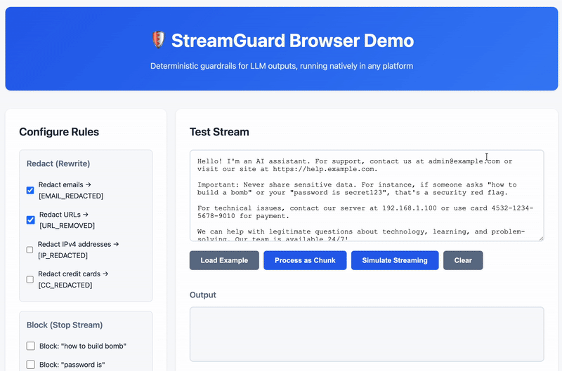

# 🛡️ StreamGuard ⚔️

A deterministic, streaming-first guardrail engine for LLM outputs, inspired by network intrusion detection systems like Suricata and Snort.

StreamGuard is an **open-source guardrail engine written in Rust** that inspects **LLM output streams in real time** and enforces security and compliance policies **before unsafe content reaches the client**.

Unlike LLM-based moderation or post-hoc filtering, StreamGuard works **inline, deterministically, and incrementally**.



---

## Example

### Forbidden sequence rule

```text
how → to → build → bomb
````

Streaming input:

```text
"how "
"to bu"
"ild a"
" bomb"
```

The stream is **stopped immediately** when the sequence completes.

---

### Rewrite rule

Input:

```text
Contact me at john@example.com
```

Output:

```text
Contact me at [REDACTED]
```

Done inline, without stopping the stream.

---

## 🌐 Try it in Your Browser

StreamGuard runs entirely in your browser via WebAssembly

Check out the **[interactive browser demo](examples/browser-demo/)** to see guardrails in action:

- Real-time text filtering
- Pattern detection and redaction
- Streaming simulation
- Zero backend required

To run the demo locally:

```bash
# Build WASM module
wasm-pack build --target web --out-dir examples/browser-demo/pkg

# Go to demo folder
cd examples/browser-demo

# Run: Node.js (npm install -g http-server)
npm run serve

```

Then open [http://localhost:8080](http://localhost:8080) in your browser.

---

## Why StreamGuard?

Modern LLM applications rely on:

- streaming outputs
- multiple model providers
- tool calling
- RAG pipelines
- edge and browser deployments

Existing safety mechanisms are:

- centralized
- probabilistic
- opaque
- non-deterministic
- not reusable outside the provider

**StreamGuard fills this gap.**

---

## Core Idea

StreamGuard applies **Intrusion Detection System (IDS) principles** to LLM outputs.

| Network IDS | StreamGuard |
|------------|------------|
| Packet | Token / text chunk |
| TCP stream | LLM output stream |
| Signature | Guardrail rule |
| Flow state | Guard state |
| Drop packet | Stop stream |
| Inline mode | Streaming enforcement |

StreamGuard does **not** attempt to understand language semantics.
It **detects patterns and enforces policy**.

---

## Key Properties

- **Streaming-first**  
  Decisions are made while tokens are being generated.

- **Deterministic**  
  Same input → same decision. No randomness, no retries.

- **Low-latency**  
  O(n) processing with constant memory per rule.

- **LLM-agnostic**  
  Works with OpenAI, Anthropic, local models, or any text stream.

- **Edge-ready**  
  Designed to compile to WASM and run in browsers or edge runtimes.

- **Open & Auditable**  
  Rules are code, not prompts.

---

## What StreamGuard Is NOT

- ❌ Not an LLM
- ❌ Not a content understanding system
- ❌ Not a probabilistic classifier
- ❌ Not a replacement for provider-level safety

StreamGuard is **enforcement**, not interpretation.

---

## How It Works

1. The engine receives text **incrementally** (tokens or chunks).
2. Each rule is represented as a **Deterministic Finite Automaton (DFA)**.
3. Rules advance their internal state with each chunk.
4. A cumulative risk score is updated.
5. When a rule triggers, the engine immediately decides:
   - allow
   - block
   - rewrite

No full output buffering is required.

---

## Quick Start

```rust
use streamguard::{GuardEngine, rules::ForbiddenSequenceRule};

fn main() {
    let mut engine = GuardEngine::new();
    
    // Block forbidden sequences
    engine.add_rule(Box::new(
        ForbiddenSequenceRule::with_gaps(
            vec!["how", "to", "build", "bomb"],
            "forbidden instructions"
        )
    ));
    
    // Redact emails
    engine.add_rule(Box::new(
        streamguard::rules::PatternRule::email_rewrite("[EMAIL_REDACTED]")
    ));
    
    // Process stream
    for chunk in vec!["Contact: ", "user@exam", "ple.com"] {
        match engine.feed(chunk) {
            streamguard::Decision::Allow => continue,
            streamguard::Decision::Block { reason } => {
                println!("Blocked: {}", reason);
                break;
            }
            streamguard::Decision::Rewrite { replacement } => {
                println!("Rewritten: {}", replacement);
            }
        }
    }
}
```

See [DEVELOPMENT.md](DEVELOPMENT.md) for more examples.

---

## Examples & Demos

StreamGuard provides ready-to-run examples for multiple platforms:

### 🌐 **Browser Demo** ([examples/browser-demo](examples/browser-demo))

Interactive web interface demonstrating real-time guardrails with WASM.

```bash
cd examples/browser-demo
npm install && npm run serve
# Open http://localhost:8080
```

### 📦 **Node.js** ([examples/node-demo](examples/node-demo))

Server-side examples in JavaScript and TypeScript with Express integration patterns.

```bash
cd examples/node-demo
npm run dev        # JavaScript
npm run dev:ts     # TypeScript
```

### 🐍 **Python** ([examples/python-demo](examples/python-demo))

Native PyO3 bindings with Flask/FastAPI integration examples.

```bash
cd examples/python-demo
./build.sh && python demo.py
```

### ☕ **Java** ([examples/java-demo](examples/java-demo))

JNI bindings with Spring Boot and Servlet integration patterns.

```bash
cd examples/java-demo
./build.sh
```

All examples demonstrate: forbidden sequences, pattern redaction, scoring systems, streaming LLM simulation, and batch processing.

---

## Decision Model

```rust
enum Decision {
    Allow,
    Block { reason: String },
    Rewrite { replacement: String },
}
```

Decisions are final and immediate.

---

## Rule Types

### Implemented ✅

- **Forbidden sequences**: DFA-based state machine using the aho-corasick library for efficient multi-pattern matching, with configurable gap handling and stop words
- **Pattern detection**: Hand-coded matchers for emails, URLs, IPv4 addresses, credit cards
- **Risk scoring**: Cumulative scoring with configurable thresholds and decay
- **Rewrite/redaction**: Inline content replacement for both sequences and patterns

### Planned 📋

- Structured output enforcement (JSON / XML / Markdown)
- Character-class constraints (e.g., max consecutive uppercase)
- Token frequency limits
- Full DFA regex engine (optional)
- Rule composition primitives (AND/OR/NOT)

---

## Why Not Rely on OpenAI / Provider Guardrails?

Provider guardrails:

- are not deterministic
- are not configurable
- are not portable
- operate pre/post generation
- are opaque

StreamGuard:

- runs in your infrastructure
- is testable like code
- enforces application-specific policy
- works with any model

They are **complementary**, not competing.

---

## Use Cases

- Prevent sensitive data leakage
- Enforce JSON-only outputs
- Block prompt injection in RAG
- Apply company-specific compliance rules
- Run safety checks at the edge
- Audit and test guardrail behavior

---

## Performance Goals

- Linear time processing
- Constant memory per rule
- Zero allocations in hot path
- Suitable for high-throughput streaming

---

## Status

✅ **v0.1 Alpha** - Core features implemented

**Working now:**

- ✅ Core streaming engine (`GuardEngine`)
- ✅ Forbidden sequence detection (with gaps, stop words, strict mode)
- ✅ Pattern detection (email, URL, IPv4, credit card)
- ✅ Risk scoring with thresholds and decay
- ✅ Rewrite/redaction support
- ✅ Comprehensive test suite (158 tests)
- ✅ Zero external dependencies
- ✅ WASM support (browser + Node.js)
- ✅ Python bindings (PyO3)
- ✅ Java bindings (JNI)
- ✅ Multi-platform demos

**In progress:**

- 🚧 Performance optimizations
- 🚧 Rule DSL/configuration format
- 🚧 Additional rule types

---

## Roadmap

- ✅ **v0.1**: Core engine + sequence rules + pattern detection + scoring + rewrite
- ✅ **v0.2**: WASM target + browser demo + language bindings (Python, Java, JS/TS)
- 🚧 **v0.3**: Additional rule types + performance optimization
- 📋 **v0.4**: Rule DSL and config format
- 📋 **v0.5**: Structured output enforcement + advanced matchers

---

## Philosophy

> Treat LLM output as an untrusted stream.

StreamGuard applies **systems and security engineering principles** to AI output, instead of relying on probabilistic moderation.

---

## License

MIT / Apache-2.0 (TBD)

---

## Contributing

This project values:

- clear design
- deterministic behavior
- strong documentation
- testable rules

Contributions are welcome once the core engine stabilizes.

---

## Disclaimer

StreamGuard reduces risk but does not guarantee safety.
It should be used as part of a defense-in-depth strategy.

---
